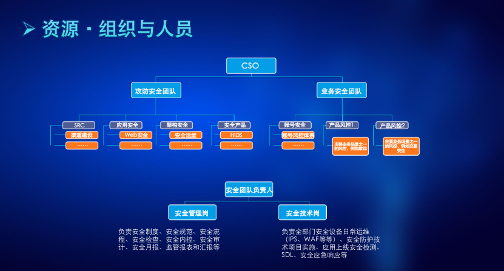

作者：聂军  
地址：金融企业安全运营建设之路.pdf

不同的信任假设决定了安全方案的复杂程度和实施成本，安全需要平衡

信息安全就是博弈和对抗，是一场人与人之间的战争。交战双方所争夺的都是信息资产的控制权，也就是在博弈和对抗中，牢牢的把握各类信息资产的控制权。

安全防护框架-纵深防御  
1：安全总控层安全：日志统一管理、SOC安全总控中心（SOC为安全运营）  
2：用户层安全管控：安全客户端、双重身份认证、堡垒机  
3：数据层安全管控：数据库防护、数据防泄漏、邮件DLP、文印系统  
4：应用层安全管控：开发安全规范、应用防护、网站防篡改、应用层漏洞扫描、安全控件  
5：系统层安全管控：安全基线、恶意软件检测、异常流量、系统漏洞扫描、蜜罐、终端安全管理  
6：虚拟层安全管控：虚拟层安全防护、虚拟主机安全加固  
7：网络层安全管控：安全域划分、防火墙、异常流量、入侵检测防御、信道加密、DNS防护

安全验证框架  
1：白盒检测（过程验证）  
  验证安全Sensor安全监测功能有效（Sensor，探针）  
  - 验证安全Sensor所产生监测信息到SIEM平台的信息采集有效  
  - 验证SIEM平台的安全监测规则有效（SIEM，security information and event management，安全信息和事件的管理系统）  
  - 验证告警方式（邮件、短信和可视化 展示平台）有效  
2：黑盒检测（结果验证）  
  - 安全众测  
  - 红蓝对抗演习  

安全为业务服务  
1：减少资损（创收）  
2：降低系统性能压力（降本）  
3：智能预警威胁感知（提效）  
4：同人模型降低安全交付认证复杂度（提升用户体验）  
5：安全应急和危机公关（保持和提升品牌公信力）  
6：积累风险库和模型反驱动业务规则优化（反欺诈、降低坏账等）

企业安全建设三个阶段  
1：基础安全建设  
2：系统建设阶段  
3：安全高阶建设  
